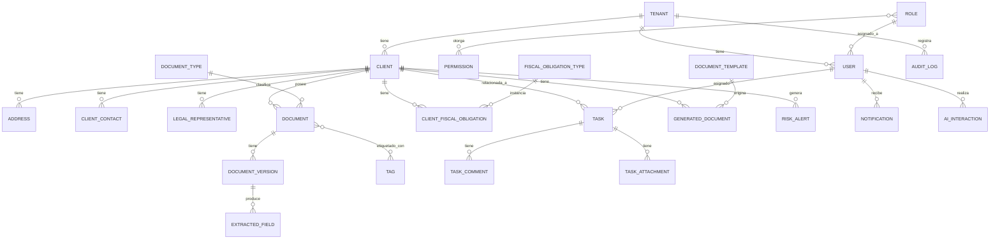

# ERP Inteligente para Despachos Contables
## Documento 2: Modelo Entidad-Relación

---

## 1. Convenciones

- Todas las entidades de negocio (no catálogos globales) incluyen `tenant_id` para soportar multi-tenant desde el diseño.
- `id` es UUID en todas las tablas (evita colisiones al migrar/replicar entre tenants).
- Campos de auditoría estándar en toda entidad: `created_at`, `created_by`, `updated_at`, `updated_by` (se omiten abajo por brevedad, pero aplican a todas).

---

## 2. Entidades y Atributos Clave

### 2.1 Tenant (Despacho)
Soporta la visión SaaS: cada despacho cliente es un tenant aislado.
| Campo | Tipo | Notas |
|---|---|---|
| id | UUID (PK) | |
| razon_social | string | Nombre del despacho |
| plan | enum | free/pro/enterprise (Fase 5) |
| status | enum | activo/suspendido |

### 2.2 Role (Rol)
| Campo | Tipo | Notas |
|---|---|---|
| id | UUID (PK) | |
| nombre | enum | Socio, Administrador, Contador, Auxiliar, Cliente |
| es_rol_sistema | bool | Roles base no editables |

### 2.3 Permission (Permiso)
| Campo | Tipo | Notas |
|---|---|---|
| id | UUID (PK) | |
| modulo | string | ej. "clientes", "documentos", "fiscal" |
| accion | enum | ver/crear/editar/eliminar/aprobar |

### 2.4 RolePermission (tabla puente)
`role_id (FK)`, `permission_id (FK)` — relación N:N

### 2.5 User (Usuario interno)
| Campo | Tipo | Notas |
|---|---|---|
| id | UUID (PK) | |
| tenant_id | UUID (FK) | |
| role_id | UUID (FK) | |
| nombre | string | |
| email | string | único por tenant |
| password_hash | string | |
| mfa_enabled | bool | |
| status | enum | activo/inactivo |

### 2.6 Client (Cliente)
Entidad central del sistema.
| Campo | Tipo | Notas |
|---|---|---|
| id | UUID (PK) | |
| tenant_id | UUID (FK) | |
| tipo_persona | enum | física / moral |
| nombre_completo | string | (persona física) |
| razon_social | string | (persona moral) |
| rfc | string | índice único por tenant |
| curp | string | nullable (moral no aplica) |
| fecha_nacimiento | date | nullable |
| regimen_fiscal | string | catálogo SAT |
| actividad_economica | string | |
| estado | enum | activo/inactivo |

### 2.7 Address (Domicilio)
| Campo | Tipo | Notas |
|---|---|---|
| id | UUID (PK) | |
| client_id | UUID (FK) | |
| calle, numero, colonia, municipio, estado, cp, pais | string | |
| tipo | enum | fiscal/otro |

### 2.8 ClientContact (Contacto)
Permite múltiples teléfonos/correos por cliente.
| Campo | Tipo | Notas |
|---|---|---|
| id | UUID (PK) | |
| client_id | UUID (FK) | |
| tipo | enum | telefono/email |
| valor | string | |
| es_principal | bool | |

### 2.9 LegalRepresentative (Representante Legal)
| Campo | Tipo | Notas |
|---|---|---|
| id | UUID (PK) | |
| client_id | UUID (FK) | solo aplica a persona moral |
| nombre | string | |
| rfc / curp | string | |
| cargo | string | |

### 2.10 DocumentType (Catálogo de tipos de documento)
| Campo | Tipo | Notas |
|---|---|---|
| id | UUID (PK) | |
| nombre | string | INE, CURP, Constancia Fiscal, Acta Constitutiva, etc. |
| campos_esperados | JSON | esquema de campos que el OCR debe extraer |

### 2.11 Document (Documento — cabecera lógica)
La cabecera no cambia; las versiones sí.
| Campo | Tipo | Notas |
|---|---|---|
| id | UUID (PK) | |
| tenant_id | UUID (FK) | |
| client_id | UUID (FK) | |
| document_type_id | UUID (FK) | |
| version_actual_id | UUID (FK) | apunta a DocumentVersion vigente |
| status | enum | vigente/vencido/pendiente_revision |

### 2.12 DocumentVersion (Versión de documento)
| Campo | Tipo | Notas |
|---|---|---|
| id | UUID (PK) | |
| document_id | UUID (FK) | |
| numero_version | int | |
| archivo_url | string | ruta en blob storage |
| checksum | string | integridad |
| ocr_status | enum | pendiente/procesado/fallido |
| ocr_confidence | decimal | nullable |
| subido_por | UUID (FK User) | |

### 2.13 ExtractedField (Campo extraído por OCR)
| Campo | Tipo | Notas |
|---|---|---|
| id | UUID (PK) | |
| document_version_id | UUID (FK) | |
| nombre_campo | string | ej. "rfc", "curp" |
| valor | string | |
| confianza | decimal | 0–1 |

### 2.14 Tag / DocumentTagAssignment
`Tag(id, tenant_id, nombre)` — `DocumentTagAssignment(document_id FK, tag_id FK)` — relación N:N

### 2.15 DocumentTemplate (Plantilla dinámica)
| Campo | Tipo | Notas |
|---|---|---|
| id | UUID (PK) | |
| tenant_id | UUID (FK) | |
| nombre | string | Contrato, Carta Poder, etc. |
| contenido_base | text | plantilla con variables `{{cliente.nombre}}` etc. |
| variables | JSON | esquema de variables requeridas |

### 2.16 GeneratedDocument (Documento generado)
| Campo | Tipo | Notas |
|---|---|---|
| id | UUID (PK) | |
| tenant_id | UUID (FK) | |
| client_id | UUID (FK) | |
| template_id | UUID (FK) | |
| generado_por | UUID (FK User) | |
| formato | enum | pdf/word |
| archivo_url | string | |

### 2.17 FiscalObligationType (Catálogo de obligaciones)
| Campo | Tipo | Notas |
|---|---|---|
| id | UUID (PK) | |
| nombre | string | IVA, ISR, DIOT, IMSS, INFONAVIT, REPSE |
| periodicidad | enum | mensual/anual |

### 2.18 ClientFiscalObligation (Obligación asignada a cliente)
| Campo | Tipo | Notas |
|---|---|---|
| id | UUID (PK) | |
| client_id | UUID (FK) | |
| obligation_type_id | UUID (FK) | |
| fecha_limite | date | |
| status | enum | pendiente/cumplida/vencida |
| semaforo | enum | verde/amarillo/rojo (calculado) |
| completado_por | UUID (FK User) | nullable |
| completado_en | datetime | nullable |

### 2.19 Task (Tarea)
| Campo | Tipo | Notas |
|---|---|---|
| id | UUID (PK) | |
| tenant_id | UUID (FK) | |
| client_id | UUID (FK) | nullable (tarea interna sin cliente) |
| asignado_a | UUID (FK User) | |
| titulo | string | |
| descripcion | text | |
| prioridad | enum | baja/media/alta/urgente |
| fecha_limite | date | |
| status | enum | pendiente/en_proceso/en_revision/terminada |

### 2.20 TaskComment / TaskAttachment
`TaskComment(id, task_id FK, user_id FK, comentario, created_at)`
`TaskAttachment(id, task_id FK, document_id FK nullable, archivo_url)`

### 2.21 Notification (Notificación/Alerta)
| Campo | Tipo | Notas |
|---|---|---|
| id | UUID (PK) | |
| tenant_id | UUID (FK) | |
| user_id | UUID (FK) | destinatario |
| tipo | enum | vencimiento_fiscal, tarea, documento_vencido, riesgo_ia |
| mensaje | string | |
| entidad_relacionada_tipo | string | ej. "ClientFiscalObligation" |
| entidad_relacionada_id | UUID | |
| leido | bool | |

### 2.22 AuditLog (Bitácora de auditoría)
Inmutable — solo insert.
| Campo | Tipo | Notas |
|---|---|---|
| id | UUID (PK) | |
| tenant_id | UUID (FK) | |
| user_id | UUID (FK) | |
| accion | string | crear/editar/eliminar/ver_sensible |
| entidad_tipo | string | |
| entidad_id | UUID | |
| valores_antes | JSON | nullable |
| valores_despues | JSON | nullable |
| ip_origen | string | |
| timestamp | datetime | |

### 2.23 AIInteraction (Interacción con el asistente IA)
| Campo | Tipo | Notas |
|---|---|---|
| id | UUID (PK) | |
| tenant_id | UUID (FK) | |
| user_id | UUID (FK) | |
| pregunta | text | |
| respuesta | text | |
| contexto_usado | JSON | qué entidades consultó (para auditar qué vio la IA) |

### 2.24 RiskAlert (Alerta de riesgo — IA)
| Campo | Tipo | Notas |
|---|---|---|
| id | UUID (PK) | |
| tenant_id | UUID (FK) | |
| client_id | UUID (FK) | |
| tipo_riesgo | enum | inconsistencia_fiscal, documentacion_faltante, operacion_inusual, patron_lavado |
| descripcion | text | |
| severidad | enum | baja/media/alta |
| status | enum | nueva/en_revision/descartada/confirmada |
| revisado_por | UUID (FK User) | nullable — **siempre requiere revisión humana** |

---

## 3. Diagrama de Relaciones (vista simplificada)

---

## 4. Notas de Diseño Importantes

1. **Aislamiento multi-tenant**: se recomienda `tenant_id` en cada tabla + row-level security en PostgreSQL (políticas RLS) en vez de una base de datos por tenant, para simplificar mantenimiento en Fase 1–4 y facilitar el salto a SaaS en Fase 5 sin reescritura.
2. **RFC/CURP como índices únicos compuestos con `tenant_id`** (no globalmente únicos), porque cada despacho maneja su propia cartera de clientes de forma aislada.
3. **Versionado de documentos**: `Document` nunca se borra ni sobrescribe; cada carga nueva crea un `DocumentVersion`. Esto da trazabilidad completa y es requisito de auditoría (Módulo 8).
4. **`AIInteraction.contexto_usado`**: guardamos exactamente qué datos consultó la IA en cada interacción — esto es clave para auditar que el asistente solo lee lo que debe y nunca hay caja negra sobre qué información usó.
5. **`RiskAlert` nunca dispara acciones automáticas** — el modelo de datos refuerza esto al no tener ninguna relación de escritura hacia `ClientFiscalObligation`, `Document` o `Task`; solo puede generar una `Notification`.

---

## 5. Siguiente Paso

Con este modelo ya podemos definir:
- **Historias de usuario** priorizadas (para saber qué construir primero del MVP).
- O si prefieres, cerramos primero el **alcance formal del MVP** (qué entidades/módulos entran en la v1).

¿Con cuál seguimos?
